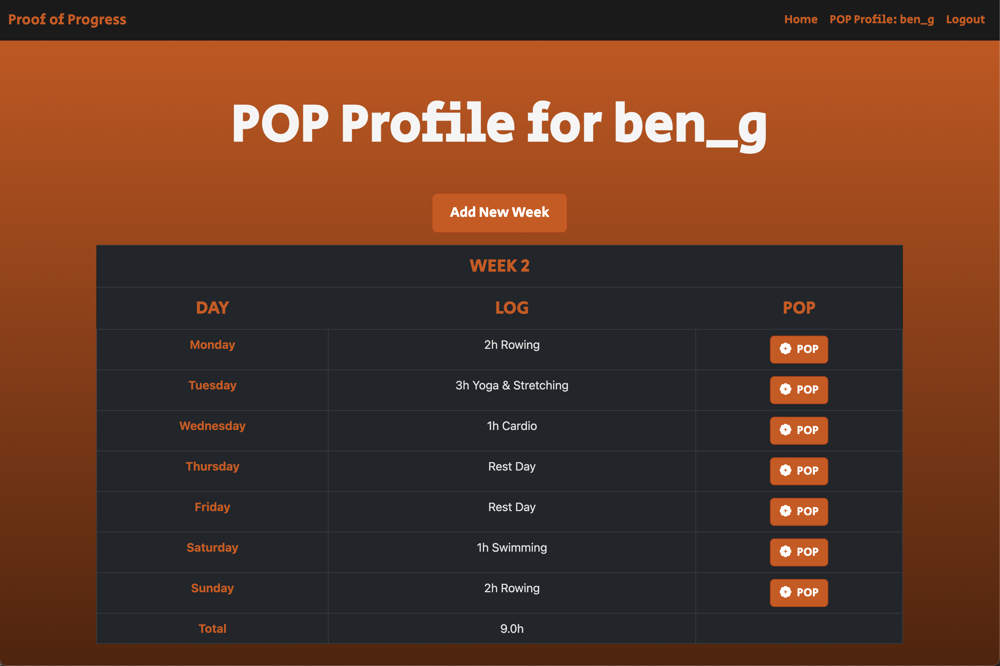
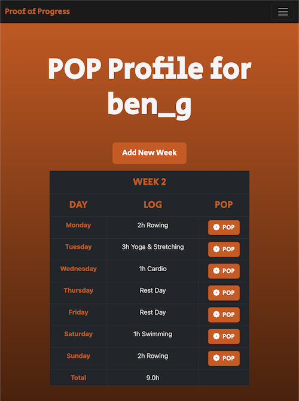

   
  <h1><b>POP - Proof of Progress</b></h1>
  <strong>Helping you log your progress on a weekly, day-by-day, hourly basis</strong>

 
<table align="center" style="border-collapse:separate;">
  <tr>
    <td style="background: #344955; border-radius:20px; border: 5px solid transparent"><small>Python</small></td>
    <td style="background: #344955; border-radius:20px"><small>Django</small></td>
    <td style="background: #344955; border-radius:20px"><small>JavaScript</small></td>
    <td style="background: #344955; border-radius:20px"><small>SQLite</small></td>
    <td style="background: #344955; border-radius:20px"><small>Bootstrap</small></td>
  </tr>
</table>

Preview of POP on a Desktop Browser

 

 

Preview of POP on a Mobile Browser
 

 

<h1><b>Installation - How To Run POP as a Web App</b></h1>

**This project can be run as a local browser app by downloading the repository. Most versions of Python are compatible with Django but if you run into issues, it is highly recommended that you use with the most recent version of Python and Django.**

**1. Download the repository and move into the folder where manage.py is located** 

**2. Create a virtual environment called venv: `python3 -m venv venv`** 

**3. Activate your venv: `source /venv/bin/activate`** 

**4. Install Django: `pip install Django`** 

**5. Now run the Web App: `python3 manage.py runserver`** 

**6. You should now be able to use the app locally using your browser at 127.0.0.1:8000** 

**Optional Step**
**7. You may notice `pop.sh` and `stop_pop.sh` files in the repo. I made these so I can double click on them like an executable file that will open and close the web app just like a program. These are for a UNIX OS, and depending on the folder directory you run the app from, you will need to edit accordingly.** 

**Administration of the web app can be done by creating a superuser account. Using manage.py, run the command: `python3 manage.py createsuperuser` and enter in the username and password of the admin account you wish to make. You will need to start the server again with `python3 manage.py runserver`** 

**The project will be made public and has ongoing development. A live version may soon be available if there is public interest**

# Table of Contents
- [Introduction](#Introduction)
   - [Registering and Login Requirements](#Register)
   - [How POP works](#How-POP-Works)
- [Distinctiveness and Complexity](#distinctiveness-and-complexity)
- [Explanation of Code](#explanation-of-code)
- [About and license](#about-and-license)

 
 
# Introduction
 POP is a web app that allows users to quickly generate a table to log the hours on each day of the week. What users choose to log is entirely up to them. Personally I use it to log both my fitness AND work-related hours for each day of the week. The tables and data entered into the tables are generated and stored dynamically, making it quick and easy. The minimal design keeps users focused and effectively scales for mobile browsers. 

## Register

POP makes use of Django's password authentication and error message modules so that users know if their account did not pass validation because of a weak password. The Register page will produce an error message if the user's password did not meet the standards set by Django's password validation. Once succesfully registered with a complex password, users are redirected to the login page.

## How-POP-Works

**Here is a video demo of POP in use: [https://www.youtube.com/watch?v=ZmZqGK3cBG4](https://www.youtube.com/watch?v=ZmZqGK3cBG4)**

# Distinctiveness and Complexity
For my capstone project I decided to make a web app that would allow users to create their own account that allows them to keep a private, weekly, day-by-day, hourly log of the hours they commit to a project of their liking. Instead of using a clunky excel spreadsheet or a text document, my web app generates an elegant template table for users to fill in each week with just a few clicks. The Register process ensures users have a secure, complex password by making custom use of Django's built-in password authentication validation and messages. Tables are generated dynamically, and data is also stored dynamically, allowing users to make quick, intuitive, and reliable use of the web app. 

Many users will be familiar with responsive tables and entering data that is saved dynamically without having to click a button to initiate a save function. However, achieving this seamless experience requires combining front and backend software, programming, and networking knowledge. JavaScript functions handle user input in real-time while Django processes and stores the data securely. The web app uses JavaScript’s event listeners to detect changes in table cells, capturing user input immediately. These inputs are then sent asynchronously via AJAX POST requests to Django’s backend, where they are validated and stored in the database. On a page refresh with valid hour entries (numbers) the Total count will automatically add the hours logged and display the total, eliminating the need for users to do any maths. The web app essentialy eliminates the need for traditional form submissions or unnecessary button functions, making it quick and reliable.

In essence, this web app goes beyond a simple logging system; it delivers a fully interactive, dynamic database-driven experience where users can log data easily and know that it is saved there for them to reflect on.

Using BootStrap styling, the web app looks contemporary and sophisticated because the web app scales the size appropriately to the user's browser whether on Desktop or via Mobile. If clicking on the Log textfield is troublesome for Mobile users, the POP button will allow users to enter or edit data more reliably. For years I have personally logged my hours on a day-by-day, weekly basis on projects such as fitness and work, but have always done so manually, as in copy and pasting text that included the Week Number, lines for Monday to Sunday, and adding up the hours for a Total tally using a bit of maths. My web app removes the need to create these tables manually, and I can now create a table and save my logs with the click of a few buttons. I hope that other users will find a similar use for the app. I called it Proof of Progress, or POP for short.

# Explanation of Code - What and Why

## workouts/templates/login.html, logout.html, register.html

I implemented Django's password validation and error messaging to ensure users know when their password does not meet security standards. In register.html, an `` block dynamically displays error messages when Django’s validation rejects weak passwords. Upon successful registration with a valid password, users are automatically redirected to the login page.

## workouts/templates/index.html, layout.html

Like most CS50 projects before the capstone, my web app has a global navbar, which is included in layout.html.
 
	•	Navbar Authentication Handling: An `` statement dynamically adjusts the menu—showing login/register links for unauthenticated users, and logout/profile links for authenticated users.
    
	•	Index Page Purpose: The index.html page, accessible to all users, provides an overview of how the web app works and how users can track their progress.

## workouts/templates/profile.html

Once logged in, users can click "Add New Week" to create their first tracking week. This button dynamically generates a table without requiring a page refresh, using JavaScript document methods to render HTML directly onto the page.
The "LOG" column in each week's table allows inline editing:
 
	•	Clicking a cell enables direct text input or users can click the "POP" button to edit.
    

	•	Data is saved dynamically without requiring a refresh, using JavaScript’s fetch POST request to /update_entry/, ensuring data persistence.
    

	•	The function editLogEntry() enables this, allowing input fields to appear dynamically and saving data when the user presses Enter or clicks outside the input box.
    

Additionally, users do not need to manually track their total weekly hours.
 

	•	If a user logs hours in the format "1h", "2.5h", "0.5h", etc., my profile_view function in views.py automatically calculates the total hours and displays them in the "Total" row.
    

	•	This is achieved using Python’s regex (re.findall()), which extracts numerical values from user inputs, allowing them to be summed dynamically.
 

## workouts/static/workout/styles.css

This file contains custom CSS styles for enhancing the UI, including:
 
	•	Bootstrap styling for tables, buttons, and icons.  
	•	Custom styling for inline-editing functionality.  
	•	Styling adjustments for responsive design.  

## workouts/views.py:

The key functions in views.py manage user data retrieval, week creation, and entry updates:
 
	•	profile_view: Retrieves all weeks and entries for the logged-in user, formatting them for frontend display. 
	•	create_week: Handles new week creation while ensuring no duplicate weeks are added.
	•	update_entry: Processes a POST request to update or create a log entry for a specific day within a week using Django's get_or_create() method.

## workouts/models.py:

Originally, I set out to build a fitness tracking app, but I realized it could be useful for more than just fitness. By this point, most of the views.py logic had already been implemented, so I kept the model names (WorkoutLog, WorkoutWeek, WorkoutEntry).
 
	•	These models store and structure user data. 
	•	They work similarly to past CS50 web projects, enabling data persistence across sessions. 

## workouts/urls.py

Defines the routes for key pages, including:
 
	•	User authentication (/login/, /logout/, /register/).  
	•	Profile management (/profile/).  
	•	Asynchronous API endpoints (/create_week/, /update_entry/).  

# About and Licence
This project was submitted as the capstone project for CS50w from HarvardX.
More information about the CS50w requirements available at https://cs50.harvard.edu/web/2020/projects/final/capstone/

This is a personal project completed by the author, which you are welcome to use and modify at your discretion. (MIT Licence)
